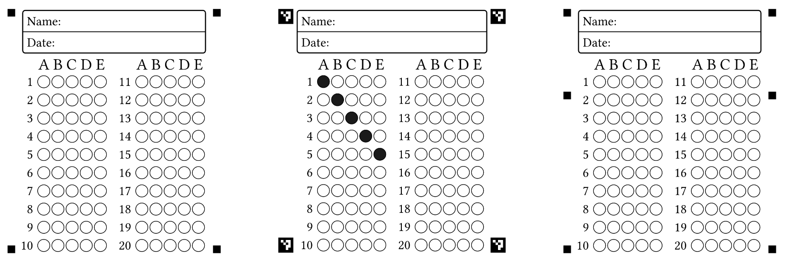
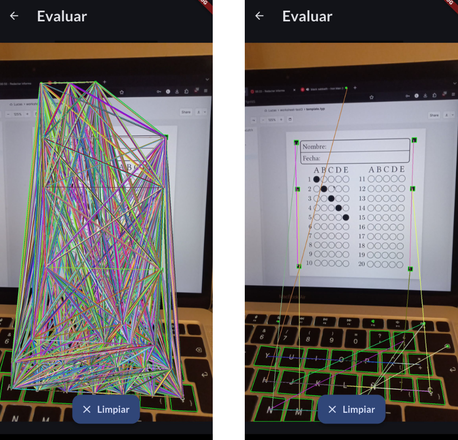
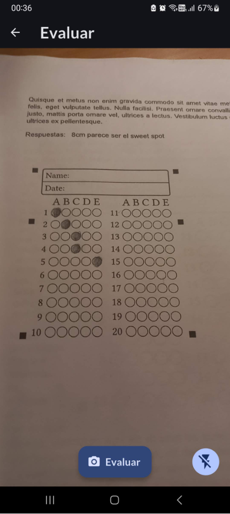
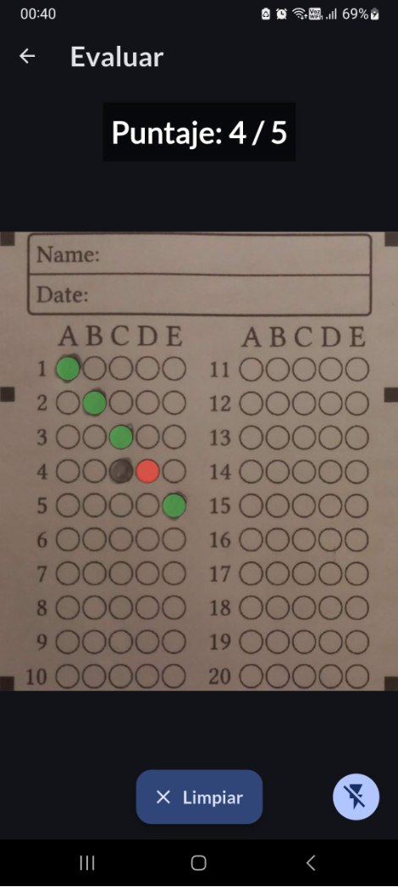

El problema que PhotoTick resuelve es el siguiente: soy un docente que quiere calificar pruebas de selección múltiple con la cámara del celular. El proceso manual es lento, por lo que una solución basada en OMR (Optical Mark Recognition) nos debería ayudar.

Cuando decidí construir PhotoTick mi objetivo era sencillo: resolver un dolor real para una profesora (necesitaba una herramienta 100% offline y gratuita) y aprender más sobre la visión por computador en dispositivos móviles.

En este post me gustaría compartir cómo estructuré la solución usando Flutter, los desafíos técnicos a los que me enfrenté y las lecciones más importantes que me llevé sobre las limitaciones de la visión por computador tradicional.

## Desafío 1: Diseñar el template desde cero (o cómo 'orientar' la hoja)

El primer desafío fue el **papel**, no el código. Diseñé programáticamente (usando la herramienta <a href="https://typst.app/home" target="_blank" rel="noopener noreferrer">Typst</a>) una hoja de respuestas. Mi primera versión tenía cuatro marcadores cuadrados, uno en cada esquina. Funcionaba bien, hasta que roté la hoja. Dada una hoja de respuestas, no era posible determinar una regla sencilla para saber cuál era la orientación correcta.

### ArUco markers

Para poder dar direccionalidad, probé usando ArUco markers. Estos marcadores determinan un vector con posición, y por suerte vienen implementados directamente en la librería de OpenCV. Esto rompió la simetría y dio direccionalidad. Sin embargo, conversando con profesores **notamos inmediatamente que la impresión en colegios casi nunca es perfecta**, y cualquier imperfección rompía la detección de los ArUco markers cuando estos son muy pequeños.

### Simplificando direccionalidad

**La solución:** un sistema de 6 marcadores sólidos. Puse 4 en las esquinas y 2 en el centro, pero ligeramente desplazados hacia arriba. Si el algoritmo detectaba esta asimetría geométrica mediante reglas sencillas, **la lectura se volvía invariante a la rotación**.

<figure>

  <figcaption>Evolución del template. Primero 4 cuadrados sólidos, luego ArUco markers, y finalmente 6 cuadrados sólidos.</figcaption>
</figure>

## Desafío 2: Las heurísticas en OpenCV

De manera paralela al diseño del papel, estuve implementando el pipeline de visión. Utilicé el paquete **`opencv_core`** de Flutter para hacer preprocesamiento de bajo nivel (escala de grises, CLAHE para el contraste, Gaussian Blur y Adaptive Thresholding) en celulares.

En resumen, el pipeline es el siguiente:

1. Buscar todos los contornos (`cv.findContours`).
2. Filtrar los que **parezcan cuadrados** (por área, convexidad y aspect ratio).

    Perfeccionar lo anterior tomó mucho tiempo. Usando solamente técnicas clásicas de Visión por Computador se obtienen **muchos falsos positivos**.

3. Filtrar los tripletes: agrupar estos cuadrados en tríos. Deben ser colineales y cumplir una proporción estricta: la distancia entre el cuadrado superior y el central debe ser exactamente el 35% de la distancia total.

<figure>

  <figcaption>Tripletes sin filtrar vs. tripletes filtrados por reglas.</figcaption>
</figure>

4. Tomar pares de estos tripletes (en total 6 cuadrados) y, para cada par, obtener un score y una viabilidad, ponderando estos factores:

    - Qué tan rectangular es el área que determinan las 4 esquinas más externas de los tripletes.
    - Qué tan grande es el área.
    - Si son paralelos los segmentos entre los cuadrados correspondientes de los tripletes.

    De esta forma, de todos los pares de tripletes que son viables, se toma el que tenga mayor score. Si no hay ninguno viable, el algoritmo considera que no está mirando una hoja de respuesta.

5. Corregir la perspectiva: se normaliza la perspectiva de la hoja usando `getPerspectiveTransform` de OpenCV. Este paso es importante porque un usuario nunca podrá obtener una imagen completamente perpendicular a la hoja.

## Desafío 3: Flutter, la UI congelada y la arquitectura de la app

El procesamiento de imágenes es pesado, y lo es aún más cuando se usa una librería no nativa, *cross-platform* como `opencv_core`. Después de ejecutar mi pipeline de OpenCV muchas veces, me di cuenta de un gran problema: la evaluación tomaba mucho más de 16ms. Al correr en el hilo principal de Flutter, la **interfaz gráfica se congelaba** por completo durante cientos de milisegundos.

Tuve que refactorizar e implementar **Isolates** para mover el cómputo pesado a otro hilo de Flutter. El flujo quedó así:

1. La cámara de Flutter captura el frame.
2. La imagen viaja al Isolate donde OpenCV hace su magia (detección, transformación de perspectiva y lectura de intensidad de luz en las casillas).

3. El resultado vuelve al hilo principal y se comunica mediante el patrón MVVM usando el package `provider`.

4. Finalmente, un `CustomPainter` dibuja la retroalimentación en la UI (círculos verdes para las correctas, rojos para las incorrectas) sobre la imagen escaneada.

Además, para cumplir con el requisito de que la app funcionara 100% offline, toda la persistencia de las evaluaciones y pautas (el ground truth) se manejó de forma local utilizando `sqflite`.

<figure>

  <figcaption>Hoja de respuestas sin evaluar.</figcaption>
</figure>

<figure>

  <figcaption>Resultado de la evaluación, pintado con `CustomPainter` encima.</figcaption>
</figure>

## Último desafío: Visión por computador en el mundo real

Logré que el sistema funcionara. Tenía un MVP completo y una tasa de éxito de recorte del **90% en condiciones de luz controladas**. Si lograba detectar la región de interés, entonces siempre evaluaba bien. Hasta ahí todo bien.

Sin embargo, hubo comportamientos de la vida real que no pudimos resolver. Uno de los profesores corcheteó el template demasiado cerca del borde de la hoja y la dejó permanentemente "doblada". Otras veces las imágenes presentaban sombras tan potentes frente a las cuales el algoritmo de Adaptive Thresholding no podía hacer nada al respecto.

Descubrí que, sin importar qué tan agresivo fuera el preprocesamiento ni qué tan perfecto pudiera ser mi Adaptive Thresholding, **un algoritmo basado estrictamente en reglas geométricas y heurísticas es inherentemente frágil**. Si un solo cuadrado del marcador se deformaba por una arruga o se perdía por un reflejo, el "triplete" jamás se formaba y el pipeline entero fallaba irremediablemente. Parchear una heurística siempre rompía otra, en parte porque las condiciones de luz cambian y en parte porque el papel es un medio sensible a las condiciones de la vida diaria.

### ¿Qué haría diferente hoy?

Si tuviera que empezar la versión 2.0 mañana, descartaría las heurísticas manuales para la detección de la hoja y apostaría por *deep learning*.

Entrenaría un modelo de *landmark detection* (quizás usando una CNN ligera optimizada para móviles) que aprenda a encontrar directamente las 4 esquinas de la región de respuestas, sin importar si el papel está arrugado, la luz es pésima o hay sombras invasivas. Dejaría el procesamiento clásico de imágenes solo para la lectura final de la tinta, pero le delegaría la detección de la hoja a una red neuronal.

En paralelo a lo anterior, en vez de usar un enfoque multiplataforma con Flutter, desarrollaría las apps de manera directa en cada plataforma. Usar Jetpack Compose y Swift me permitiría interactuar directamente con las APIs de más bajo nivel de la cámara, y tener mayor rendimiento en el proceso.

## Conclusión

Construir PhotoTick no me hizo inventar un nuevo estado del arte, pero me obligó a meter las manos en el barro. Me enseñó a conectar el hardware de la cámara, el rendimiento (Isolates), la persistencia local de datos, algoritmos matemáticos complejos y el diseño de la experiencia de usuario.

Fue bueno estrellarme contra la pared intentando hacerlo yo mismo. Para probar PhotoTick se puede descargar su APK para Android directamente en
<a href="https://phototick.com/" target="_blank" rel="noopener noreferrer">phototick.com</a>.